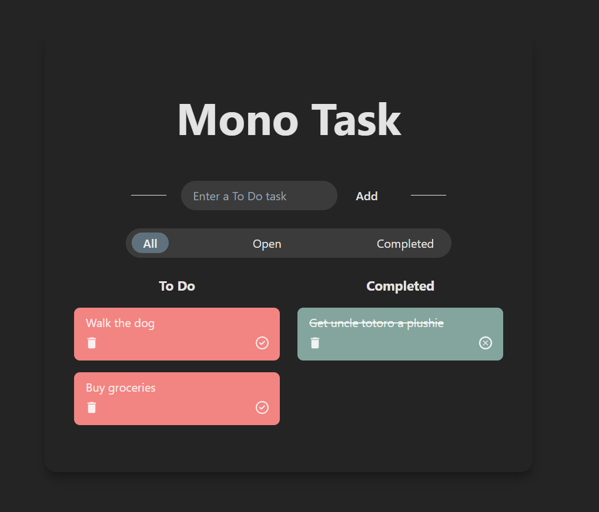

# Coding challenge

1. Create a simple to-do list application using React and Tailwind for styling.
2. The application should allow users to add, delete, and mark tasks as completed.
3. Implement a filter feature to view all tasks, completed tasks and open tasks.

React documentation: Learn React https://react.dev/learn
Tailwind documentation: https://tailwindcss.com/docs/margin

# Mono Task - Your simple and modern To Do List

This Vite React app project is a simple, modern flat themed To Do List.
Users can add To Do tasks, mark/unmark them as completed and delete them.
The user can filter the tasks for _Completed_, _Open_ and _All_ tasks.



## Setup

Install Node and npm via https://nodejs.org/en/download.

```bash
# Install Node.js

# Install the packages for this repository
npm install
npm install react-icons --save
```

## Run

```bash
npm run dev

# Open your browser and go to http://localhost:3000
```

## Review
This was done in a span of 1 week and with little to no experience in React, Git and Typescript. It was both very fun and challenging.
Further Improvements and Features that crossed my mind:
- Toggle between Light/Dark Mode
- Mobile View
- Search Function to find tasks
- Add smoother transitions and animations for a better user experience
- Adding Images to tasks
- Login Feature to save data online and enable synchronisation
- and many more possibilites...
